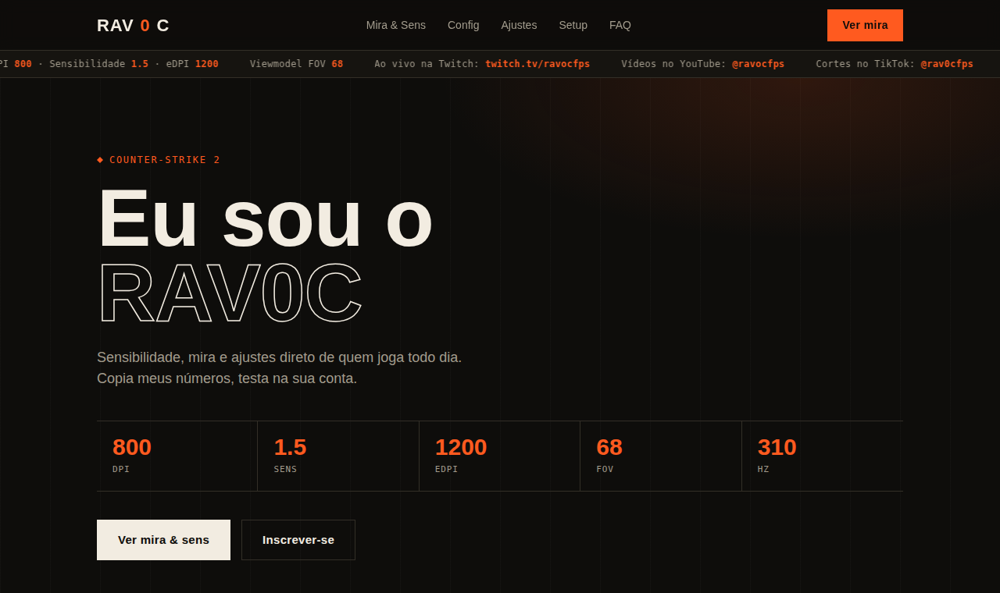

# RAV0C · Mira, Sens & Config (CS2)

Site para o streamer de Counter-Strike 2 **RAV0C**: sensibilidade, mira, configurações e setup num só lugar, com identidade visual própria.

🌐 **[Ver o site](https://japinha01.github.io/ravocfps/)**

## Destaques

- **Construtor de mira interativo** em `<canvas>`: a mira do streamer é desenhada ao vivo, com o código de compartilhamento do CS2 pronto para copiar
- Faixa animada (ticker) com DPI, sensibilidade, eDPI e links das redes
- Seções de mira e sens, config, ajustes de vídeo, setup e FAQ em acordeão
- Responsivo, sem framework e sem build: um único `index.html`

**Tecnologias:** HTML · CSS · JavaScript · Canvas API · GitHub Pages
